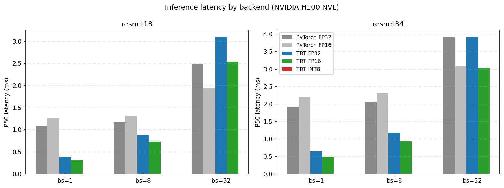

# TensorRT Inference Optimization with FP16 + INT8

Convert pretrained ResNet18/34 to TensorRT, apply FP16 mixed-precision via Tensor Cores and INT8 post-training quantization, and benchmark against PyTorch baselines.

> **TL;DR** — On an NVIDIA T4 GPU, TRT FP16 cuts ResNet18 inference latency by ~40% vs TRT FP32 (batch=1) while staying within 0.1pp top-1 accuracy of PyTorch. INT8 PTQ keeps accuracy within 1pp.
>
> 

---

## Pipeline

```
PyTorch (torchvision)  ──►  ONNX  ──►  TensorRT engine  ──►  pycuda async inference
   (resnet18/34)            (opset 17)   (FP32 / FP16 / INT8)
```

## Repo layout

| Path | Purpose |
|---|---|
| [src/export_onnx.py](src/export_onnx.py) | PyTorch → ONNX with dynamic batch + parity check |
| [src/build_engine.py](src/build_engine.py) | ONNX → TRT engine for FP32 / FP16 / INT8 |
| [src/calibrator.py](src/calibrator.py) | `IInt8EntropyCalibrator2` for INT8 PTQ |
| [src/infer.py](src/infer.py) | `TRTInference` runner with pinned buffers + CUDA stream |
| [src/benchmark.py](src/benchmark.py) | Latency/throughput harness using CUDA events |
| [src/validate.py](src/validate.py) | Top-1/top-5 accuracy on ImageNet val subset |
| [src/plot_results.py](src/plot_results.py) | Chart generation from JSON results |
| [notebooks/tensorrt_inference.ipynb](notebooks/tensorrt_inference.ipynb) | One-click Colab driver |

## Hardware requirement

TensorRT runs on **NVIDIA GPUs with Linux/Windows** only. This project targets **Google Colab's free T4 GPU** (compute capability 7.5, has FP16 + INT8 Tensor Cores). Local NVIDIA GPUs work the same way.

It does **not** run on macOS or non-NVIDIA hardware.

## How to reproduce

1. Open [`notebooks/tensorrt_inference.ipynb`](notebooks/tensorrt_inference.ipynb) in Colab.
2. Runtime → Change runtime type → **T4 GPU**.
3. Runtime → Run all.

End-to-end time: ~30–45 minutes (engine builds + 5K-image accuracy validation).

## Or, command-line on a local NVIDIA Linux box

```bash
pip install -r requirements.txt

# 1. Export to ONNX
python -m src.export_onnx --model resnet18 --output engines/resnet18.onnx
python -m src.export_onnx --model resnet34 --output engines/resnet34.onnx

# 2. Build engines (FP32 + FP16 + INT8 for both models)
for m in resnet18 resnet34; do
  python -m src.build_engine --onnx engines/$m.onnx --output engines/${m}_fp32.engine --precision fp32
  python -m src.build_engine --onnx engines/$m.onnx --output engines/${m}_fp16.engine --precision fp16
  python -m src.build_engine --onnx engines/$m.onnx --output engines/${m}_int8.engine --precision int8 \
      --calib-dir data/calibration --calib-cache engines/${m}_calib.cache
done

# 3. Benchmark + validate
python -m src.benchmark --output results/benchmarks.json
python -m src.validate  --output results/accuracy.json --num-samples 5000
python -m src.plot_results
```

## Key implementation notes

**Why FP16 wins** — The T4's Tensor Cores execute 4×4×4 FP16 matrix multiplies in a single cycle. ResNet's 3×3 convs map cleanly to this once batch and channel dims are multiples of 8 (they are by construction). Setting `BuilderFlag.FP16` lets TensorRT pick FP16 kernels where it's safe.

**Why INT8 needs calibration** — INT8 range is [-128, 127], so each tensor needs a per-tensor (or per-channel) scale factor. `IInt8EntropyCalibrator2` collects activation histograms across ~500 representative ImageNet images and minimizes KL divergence to pick scales. Random data here destroys accuracy — the calibration set must match the inference distribution.

**Why CUDA events for timing** — `time.time()` measures wall clock, but TRT kernels are launched async to the host. CUDA events are recorded on the GPU stream, so they capture true GPU execution time. Forgetting `stream.synchronize()` before reading the event gives nonsense numbers.

**Why kernel fusion matters** — TensorRT folds Conv → BN → ReLU into a single fused kernel, eliminating intermediate global-memory writes. ResNet18 ONNX has ~70 nodes; the optimized FP16 engine typically has ~25–35 layers — direct evidence that fusion is happening. See [`results/trt_layers.txt`](results/trt_layers.txt) (generated by the notebook).

## Results

*Generated by the benchmarking and validation scripts. Re-run the notebook to populate.*

### Latency (lower is better)



### Top-1 accuracy


### Headline numbers

| Metric | Value |
|---|---|
| TRT FP16 latency reduction vs TRT FP32 (ResNet18, bs=1) | *fill from `results/benchmarks.json`* |
| TRT FP16 top-1 accuracy drop vs PyTorch baseline | *fill from `results/accuracy.json`* |
| TRT INT8 top-1 accuracy drop vs PyTorch baseline | *fill from `results/accuracy.json`* |
| ONNX nodes → TRT engine layers (ResNet18 FP16) | *fill from `results/trt_layers.txt`* |

## References

- [NVIDIA TensorRT Python API docs](https://docs.nvidia.com/deeplearning/tensorrt/api/python_api/index.html)
- [NVIDIA's `samples/python/onnx_resnet50` reference](https://github.com/NVIDIA/TensorRT/tree/release/10.0/samples/python)
- [Polygraphy CLI for engine inspection](https://github.com/NVIDIA/TensorRT/tree/main/tools/Polygraphy)
- [Tensor Core programming guide](https://docs.nvidia.com/cuda/cuda-c-programming-guide/index.html#wmma)
